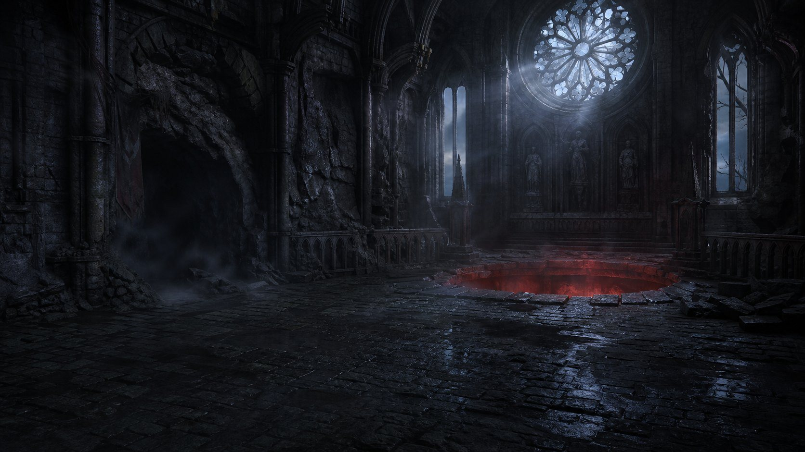

<p align="center">
  
</p>

<h1 align="center">VEIL</h1>

<p align="center">
  <em>one red light in the fog</em><br/>
  Gothic Zuma · React · canvas 2D
</p>

<p align="center">
  
  
  
  
</p>

---

## Об игре

**VEIL** — змея из цветных сфер ползёт по вырезанному в камне жёлобу из пещеры к алой норе. Ты стоишь внизу с турелью и стреляешь шарами в цепь: **три и больше одного цвета подряд** лопаются, очки растут, а вся цепь **отползает назад**. Если красные глаза доползут до норы — завеса падёт не в твою пользу.

Комбо за цепные взрывы: подряд идущие взрывы в течение короткого окна умножают очки. С каждыми секундами цепь ползёт быстрее, а через 42 секунды просыпается пятый цвет — становится строже. Победа — снести всю цепь до последнего шара.

Палитра и атмосфера — как у профиля [sasuke22233](https://github.com/sasuke22233): графит, лёд, фиолет, один красный глаз. Без аккаунтов, без сервера, без трекеров: всё считается локально в браузере.

---

## Управление

| | |
| :--- | :--- |
| **PC** | мышь — прицел, ЛКМ / пробел — выстрел, ПКМ / Shift / Q — смена цвета |
| **Phone** | тап по полю — выстрел в эту точку, кнопка **смена** справа внизу |

Цель: уничтожить всю цепь до того, как голова доползёт до норы.

---

## Движок

Свой игровой движок на **Canvas 2D** — без игровых библиотек и движков, только React для HUD и ввода.

**Трек** (`src/game/path.js`)
- жёлоб собирается из опорных точек интерполяцией **Catmull-Rom**, затем дискретизируется в полилинию с накопленной длиной дуги;
- позиция любого шара — это скаляр `s` вдоль трека, точка и касательная ищутся **бинарным поиском** за `O(log n)`;
- при ресайзе длина трека пересчитывается, позиции всех шаров переносятся пропорционально — ничего не разъезжается.

**Цепь и матчи** (`src/game/engine.js`)
- старт: 54 шара, 4 цвета, генерация без тройных совпадений на старте;
- выстрел вставляет шар **перед или за** целью по касательной, группы переупаковываются до контактного шага;
- поиск прогонов ≥ 3 одного цвета → взрыв: очки `шары × 10 × комбо`, откат цепи назад, вспышка и тряска;
- группы, отставшие друг от друга, **догоняют** впереди идущие — как в классической Zuma;
- прогрессия: скорость `32 → 62` единиц/с по времени, с 42-й секунды включается 5-й цвет;
- порог победы — пустая цепь; порог поражения — голова у самой норы, за 160 единиц до неё включается красное предупреждение.

**Отрисовка** (`src/game/render.js`)
- фон-арт, жёлоб с тенью, шары с бликом и внешним свечением, голова-пасть в конце жёлоба;
- частицы, волны-кольца от взрывов, тряска экрана, вспышка, HUD, пылинки в воздухе;
- DPR до 1.75 и `ResizeObserver` — картинка чёткая и на телефоне.

**Звук** (`src/game/audio.js`)
- выстрел, лопание с ростом тона по комбо, победа и поражение — синтез через **Web Audio API** (осцилляторы), аудиофайлов нет.

**Состояния** — `menu` → `play` → `win` / `lose`, игровой цикл на `requestAnimationFrame` с фиксированным шагом и защитой от фризов (`dt` ограничивается).

---

## Стек

- **React 18** — только оболочка, HUD и обработка ввода
- **Vite 5** — сборка и дев-сервер
- **Canvas 2D** — вся графика
- **Web Audio API** — звук
- JavaScript (ES modules), без TypeScript, без UI-фреймворков

---

## Структура

```text
src/
  game/
    path.js      сплайн трека, выборка точек по длине дуги
    engine.js    состояние, физика цепи, вставки, матчи, комбо
    render.js    отрисовка мира и эффектов
    audio.js     синтез звуков
  Game.jsx       игровой цикл, ввод, HUD
  assets/        окружение, голова, пасть
docs/
  cover.jpg      обложка
```

---

## Локальный запуск

Нужны **Node 18+** и npm.

```bash
npm install
npm run dev
```

Открой адрес, который напишет Vite (обычно `http://localhost:5173`).

Продакшен-сборка:

```bash
npm run build
npm run preview
```

---

## License

MIT. Ассеты сгенерированы для этого проекта.
